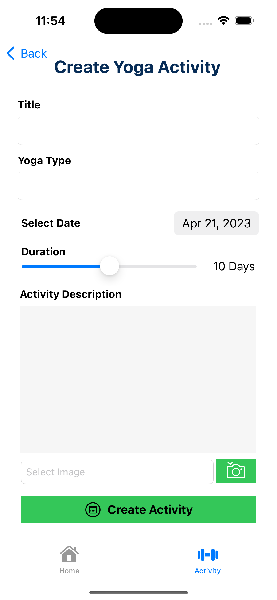

Please go under edit and edit this file as needed for your project.  There is no seperate documentation needed.

# Project Name - Fit Yoga
# Student Id - IT20104108
# Student Name - Dissanayake D.M.A.A

#### 01. Brief Description of Project - This project is a fully functional project which users can manage their yoga activitie.  In this app users can add a schort description aboout yoga activities and they can go through it. Then users can shedule a date and set a time duration for do their yoga activities and categorize them as pending or completed. Users can edit or delete their activities as well.
#### 02. Users of the System - Customers
#### 03. What is unique about your solution - The uniqueness of Yoga Fit lies in its combination of scheduling and activity tracking features specifically designed for yoga. While there are many fitness and activity tracking apps available, Yoga Fit offers a more focused approach for users interested in yoga. The app allows users to add descriptions for their yoga activities, which can help users create a more personalized plan tailored to their specific needs and goals. Additionally, the app's scheduling feature provides users with the ability to plan their yoga activities ahead of time, ensuring they can fit yoga into their busy schedules. Finally, the app's categorization of activities as pending or completed allows users to easily track their progress and stay motivated. By providing a comprehensive solution for managing and tracking yoga activities, Yoga Fit stands out as a unique and valuable tool for yoga enthusiasts.
#### 04. Briefly document the functionality of the screens you have (Include screen shots of images)
The first screen is the launch screen of the app


This screen retrieves all the data 
 

This displays a specific data set in the app
  

This screen displays create data page
  

This appears update page
  

This is the delete function in the app 
  

#### 05. Give examples of best practices used when writing code
e.g The code below uses consistant naming conventions for variables, uses structures and constants where ever possible. (Elaborate a bit more on what you did)

```
  struct User {
    let firstName: String
    let lastName: String
    let age: Int
    let email: String?
    
    init(firstName: String, lastName: String, age: Int, email: String? = nil) {
        self.firstName = firstName
        self.lastName = lastName
        self.age = age
        self.email = email
    }
    
    func sendEmail(to recipient: String, subject: String, message: String) {
        guard let email = self.email else {
            print("Cannot send email. No email address on file.")
            return
        }
        
        // Code to send email goes here
        print("Sending email to \(recipient) from \(email) with subject: \(subject)")
        print("Message: \(message)")
    }
}
```

#### 06. UI Components used

e.g. The following components were used in the Landmark Identify App, UIButton, UIAlert, UIViewController, UINavigationController

#### 07. Testing carried out

e.g. The following classes implemented unit testing for the ```Landmark struct``` and ```Location struct```. 

```
    struct TestLandMarks {
       let name: String
```

#### 08. Documentation 

(a) Design Choices
      
    •	Simple and User-Friendly Interface: A clean and intuitive interface is essential for any mobile app. Users should be able to easily navigate the app and find the features they need.
    •	Clear Categorization: Activities should be clearly categorized as pending or completed, making it easy for users to track their progress.
    •	Customizable Options: Users should be able to add a short description about their yoga activity and customize the duration and time of their yoga session to fit their unique needs.
    •	Editing and Deleting Features: Users should have the option to edit or delete their activities in case of changes in their schedule or interests.
    •	Scheduling: The app should include scheduling features to help users plan their yoga sessions ahead of time and stay on track.


(b) Implementation Decisions
      
    •	Platform and Programming Language: The app could be developed for iOS platforms using programming language Swift.
    •	Data Storage: The app could store user data as core data
    •	UI/UX Design: The app could be designed using uikit to create a visually appealing and user-friendly interface.


(c) Challenges

Among these are issues with time management, design, debugging, and expertise of programming technologies like Xcode, Swift, and UIKit.
Because of this barrier, developers may need to put in more time learning how to make the most of available development tools. Methods such as consulting with seasoned programmers or reading relevant documentation could be used for this purpose.

The success of a mobile app is directly proportional to how well its UI is designed. To build a user-friendly and straightforward interface that is tailored to the user's demands, a developer needs to have strong design abilities and an understanding of UI best practises. This may involve looking into current trends in user interface design, testing the design with real people, and iterating until the design is perfect.

In software development, one of the most prevalent difficulties is debugging problems, which can be both time-consuming and irritating. To ensure the correct operation of the programme, a developer may need to spend additional time thoroughly analysing their code, discovering problems, and repairing them.
Developing a mobile app requires careful time management, especially if you already have other commitments. Effective time management for developers often requires setting deadlines for projects, assigning priorities, and planning for breaks to prevent burnout. This helps make sure they can devote adequate time to the project without letting their other commitments suffer.

#### 09. Reflection

Technical Complexity: Developing a mobile app requires a high level of technical expertise in coding languages such as Swift and Xcode. This can be a significant challenge for novice developers who are not familiar with these programming languages.

Compatibility Issues: Developing a mobile app that works across multiple devices and operating systems can be challenging, as different devices and operating systems have different hardware specifications and requirements.

User Interface and User Experience: Developing a visually appealing and user-friendly interface that provides a great user experience is a critical aspect of mobile app development. Achieving this requires a thorough understanding of user behavior and preferences, which can be challenging.


  

